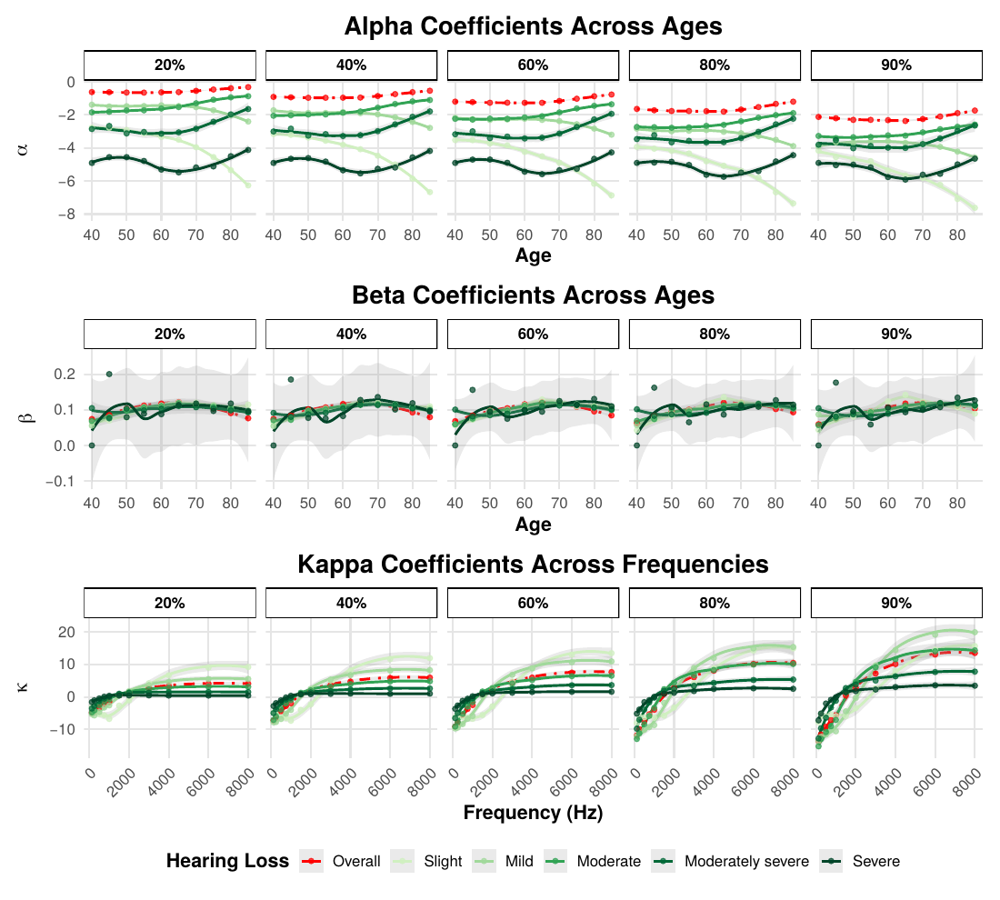

# SpiN — Standardised hearing-loss risk profiles with state-space models

Code for *Standardised Hearing Loss Risk Profiles with State-Space Models*
(Campi, Peters, Morvan, Buhl, Thai-Van; [SSRN 5085963](https://papers.ssrn.com/sol3/papers.cfm?abstract_id=5085963)).

Pure-tone audiometry alone misses much of what hearing loss does to speech perception.
This project builds **population-level reference profiles** of hearing-loss risk by age,
sex, degree of hearing loss and frequency, combining audiograms with speech-in-quiet and
speech-in-noise tests.

The core is the **CPBMT model**, a state-space model that treats frequency the way
mortality models treat age (cf. Lee–Carter in demography, Nelson–Siegel for yield
curves): a latent common trend across the audiogram, with segment-specific loadings.
Two versions are compared — audiogram only, and audiogram plus speech tests — and
likelihood-ratio and Vuong tests assess whether population segments differ.



## Repository layout

| File | Role |
|---|---|
| `code/utils.R` | Model definitions and fitting functions used by all scripts |
| `code/CPBMT_Data_Analysis.R` | Data cleaning and descriptive statistics |
| `code/CPBMT_Model_Selection.R` | Model selection (MSE across age groupings) and performance measures |
| `code/CPBMT_Stat_Tests.R` | Likelihood-ratio and Vuong tests between models and segments |
| `code/CPBMT_Part_Reg.R` | Partial regression of speech scores on pure-tone thresholds |
| `code/CPBMT_Residuals_Mod_Assessment.R` | Residual diagnostics (Supplementary Information) |
| `code/CPBMT_Plots.R` | Figures in the paper |
| `figs/` | All figures, as produced by the scripts |

## Requirements

R with, among others:

```r
install.packages(c("tidyverse", "reshape2", "viridis", "ggpubr", "gridExtra",
                   "StMoMo", "demography", "fds", "transport",
                   "lmtest", "tseries", "kableExtra"))
```

## Data

The clinical audiometric data are **not included** in this repository. The scripts read
derived `.rds` files from the directory set in the variable `mydir` at the top of each
script.

## Citation

```bibtex
@article{campi2025standardised,
  title   = {Standardised Hearing Loss Risk Profiles with State-Space Models},
  author  = {Campi, Marta and Peters, Gareth and Morvan, Perrine and Buhl, Mareike and Thai-Van, Hung},
  journal = {Available at SSRN 5085963},
  year    = {2025}
}
```

## License

MIT — see [LICENSE](LICENSE).
